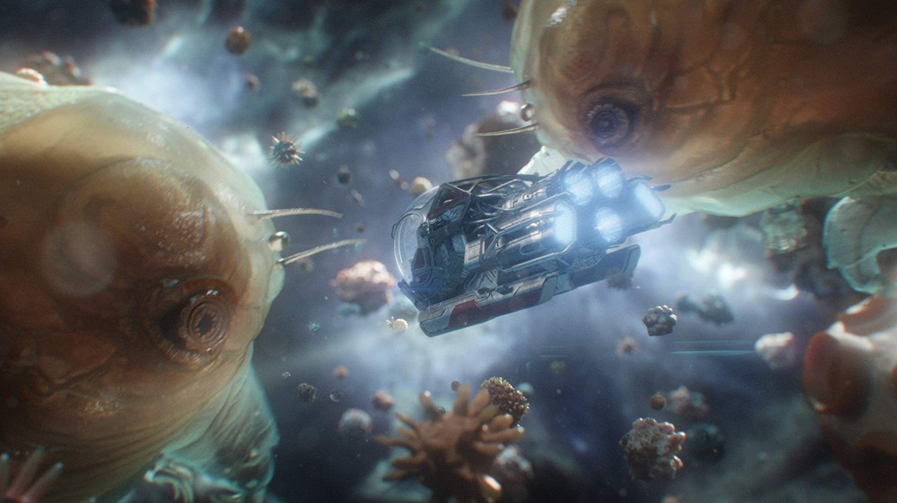
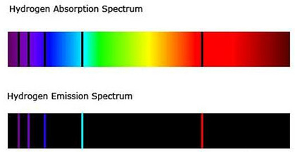
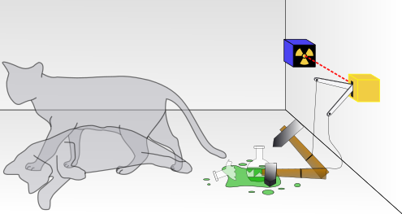

 



# Introduction

In Marvel's Ant-Man and the Wasp: Quantumania, Ant-Man and his daughter Cassie find themselves trapped in the quantum realm: a bizarre and unforgiving dimension outside of our usual laws of physics, which is reachable only by shrinking down beyond microscopic size. While you will not find the crazy creatures and intergalactic intrigue of Ant-Man in the real quantum realm, the movie did get one thing right: the quantum realm is a difficult place to navigate! In this post, we will swap tiny spaceships for math and see how to use reinforcement learning to get from point A to point B in the real quantum realm! This ability to effectively get from point A to point B is key ingredient in "quantum computers," a new type of computer that has the potential to solve large-scale problems in science and engineering more efficiently than computers used today.

<!--   -->

## What is a quantum system?

In Ant-Man, the quantum realm is the land of tiny smaller-than-microscopic beings. In real life, this would be the land of individual atoms or electrons, the basic building blocks of our world. Although the impact of quantum physics is not restricted to objects of this size, it is in these tiny particles that its impacts are the most clearly seen.

"Quantum" is related to the word "Quanta," which refers to discrete units of a phenomenon. For example, one quanta of electricity is an electron and one quanta of dishwasher detergent is a [Finish Powerball Quantum](https://www.finishdishwashing.com/products/detergents/quantum-detergent/). Quantum physics is the set of rules that govern these discrete units (although, as I will explain, modeling the detergent with quantum physics would be very difficult). It dictates that energy is inherently quantum, or that every object has discrete energy levels, like moving up stairs in a staircase. 

So why do we not notice these discrete levels in everyday life? This is because there are so many levels so close together that we can not perceive them as different. For example, a 1 kg pendulum that swings 1 cm in the air could have something like $ 10^{30} $ energy levels, or about 1 million times more levels than there are stars in the entire universe. The situation is like when you are watching a YouTube video with a good internet connections. If the video is streaming correctly, you do not notice that it is actually made of individual images (a usual video plays at 60 frames per second). However, if your connection is slow or choppy, you begin to notice the quantum nature of your YouTube video!

A quantum system is something small enough and low energy enough that we can actually distinguish these levels. The first quantum system that scientists discovered was the hydrogen atom. Individual light particles (or quanta of light, called "photons") have an amount of energy that depends on their color. Scientists found that when they shine light on hydrogen, it absorbed very specific colors in violet, blue, and red. And it emits these same colors. It turns out that the energy of light particles with these colors correspond to the difference in between different energy levels in hydrogen.

Image credits to [Khan Academy](https://www.khanacademy.org/science/physical-chemistry-essentials/x98cdf762ed888601:structure-of-atom/x98cdf762ed888601:bohr-s-model-of-hydrogen-atom/a/absorptionemission-lines)

A quantum system also exhibits two features that would be at home in Ant-Man's quantum realm: superposition and entanglement. Superposition refers to a system being in a mixture of two states at the same time, with its final state only being determined when it is asked what state it is in. Entanglement refers to a phenomenon where the state of two different quantum systems are correlated, even in a superposition. Physicist Erwin Schrödinger, one of the pioneers of quantum physics, came up with a thought experiment known as "Schrödinger's Cat" to describe the counter-intuitive nature of these phenomenon. 

A cat has the unfortunate fate of being stuck in a box with a radioactive particle. If the particle decays it releases a hammer which shatters a vial of poison and kills the cat. If this were a true quantum system, the state of the particle and the state of the cat would be "entangled," either the particle has decayed and the cat is dead, or the particle has not decayed and the cat is alive. The cat-particle system would exist in a "superposition" of these two states, meaning the cat would genuinely be neither fully dead, nor fully alive, until someone opened the box to check. Of course, the cat-particle system is not a true quantum system, but scientists can build systems of single atoms, electrons, or light that genuinely follow these principles of superposition and entanglement.

Image credits to [Wikipedia](https://en.wikipedia.org/wiki/Schr%C3%B6dinger%27s_cat)

## What is a qubit/quantum computer and how do we control it?

# Analysis

## Data Gathering

$$x = 10$$

# Conclusions