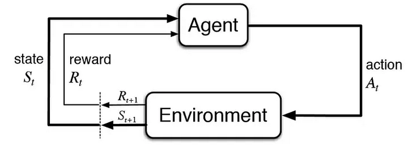
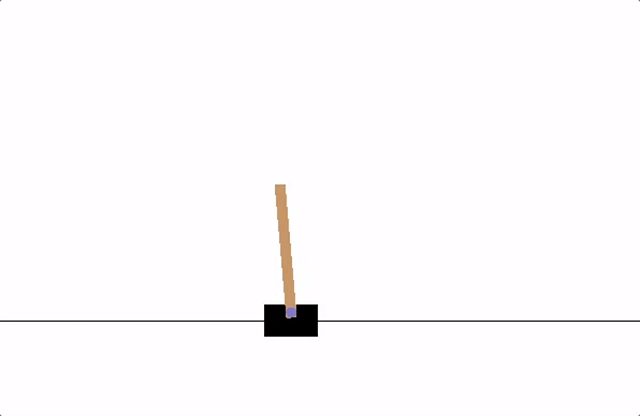

 



# Links

[Jupyter notebook with reinforcement learning results](https://github.com/eliweissler/CSCI_5576_HW/blob/main/final_project/quantum_control.ipynb)

[Python file with torchRL environment object](https://github.com/eliweissler/CSCI_5576_HW/blob/main/final_project/qcontrol.py)

# Introduction

In Marvel's Ant-Man and the Wasp: Quantumania, Ant-Man and his daughter Cassie find themselves trapped in the quantum realm: a bizarre and unforgiving dimension outside of our usual laws of physics, which is reachable only by shrinking down beyond microscopic size. While you will not find the crazy creatures and intergalactic intrigue of Ant-Man in the real quantum realm, the movie did get one thing right: the quantum realm is a difficult place to navigate! In this post, we will swap tiny spaceships for math and see how to use reinforcement learning to get from point A to point B in the real quantum realm! This ability to effectively get from point A to point B is key ingredient in "quantum computers," a new type of computer that has the potential to solve large-scale problems in science and engineering more efficiently than computers used today.

<!--   -->

## What is a quantum system?

In Ant-Man, the quantum realm is the land of tiny smaller-than-microscopic beings. In real life, this would be the land of individual atoms or electrons, the basic building blocks of our world. Although the impact of quantum physics is not restricted to objects of this size, it is in these tiny particles that its impacts are the most clearly seen.

"Quantum" is related to the word "Quanta," which refers to discrete units of a phenomenon. For example, one quanta of electricity is an electron and one quanta of dishwasher detergent is a [Finish Powerball Quantum](https://www.finishdishwashing.com/products/detergents/quantum-detergent/). Quantum physics is the set of rules that govern these discrete units (although, as I will explain, modeling the detergent with quantum physics would be very difficult). It dictates that energy is inherently quantum, or that every object has discrete energy levels, like moving up stairs in a staircase. 

So why do we not notice these discrete levels in everyday life? This is because there are so many levels so close together that we can not perceive them as different. For example, a 1 kg pendulum that swings 1 cm in the air could have something like $ 10^{30} $ energy levels, or about 1 million times more levels than there are stars in the entire universe. The situation is like when you are watching a YouTube video with a good internet connection. If the video is streaming correctly, you do not notice that it is actually made of individual images (a usual video plays at 60 frames per second). However, if your connection is slow or choppy, you begin to notice the quantum nature of your YouTube video!

A quantum system is something small enough and low energy enough that we can actually distinguish these levels. The first quantum system that scientists discovered was the hydrogen atom. Individual light particles (or quanta of light, called "photons") have an amount of energy that depends on their color. Scientists found that when they shine light on hydrogen, it absorbed very specific colors in violet, blue, and red. And it emits these same colors. It turns out that the energy of light particles with these colors correspond to the difference in between different energy levels in hydrogen.

Image credits to [Khan Academy](https://www.khanacademy.org/science/physical-chemistry-essentials/x98cdf762ed888601:structure-of-atom/x98cdf762ed888601:bohr-s-model-of-hydrogen-atom/a/absorptionemission-lines)

A quantum system also exhibits two features that would be at home in Ant-Man's quantum realm: superposition and entanglement. Superposition refers to a system being in a mixture of two states at the same time, with its final state only being determined when it is asked what state it is in. Entanglement refers to a phenomenon where the state of two different quantum systems are correlated, even in a superposition. Physicist Erwin Schrödinger, one of the pioneers of quantum physics, came up with a thought experiment known as "Schrödinger's Cat" to describe the counter-intuitive nature of these phenomenon. 

A cat has the unfortunate fate of being stuck in a box with a radioactive particle. If the particle decays it releases a hammer which shatters a vial of poison and kills the cat. If this were a true quantum system, the state of the particle and the state of the cat would be "entangled," either the particle has decayed and the cat is dead, or the particle has not decayed and the cat is alive. The cat-particle system would exist in a "superposition" of these two states, meaning the cat would genuinely be neither fully dead, nor fully alive, until someone opened the box to check. Of course, Schrödinger's Cat is not a true quantum system, but scientists can build systems of single atoms, electrons, or light that genuinely show superposition and entanglement.

Image credits to [Wikipedia](https://en.wikipedia.org/wiki/Schr%C3%B6dinger%27s_cat)

## What is a qubit/quantum computer and how do we control it?

One application of these quantum systems is to build a computer out of them! Indeed, REAL SCIENTISTS are building REAL QUANTUM COMPUTERS near you, both at [CU](https://www.colorado.edu/initiative/cubit/structure-cubit) and in [local industry](https://www.quantinuum.com/hardware/h2).

Quantum computers are built out of a collection of multiple quantum systems. For each individual system, scientists attempt to isolate only two states, hence "bit." Each quantum system acts as a "qubit," encoding information in the two-state quantum system, as opposed to using the 1's and 0's of a standard computer. Through leveraging the effects of superposition and entanglement, these quantum computers could eventually solve problems that would be impossible for even today's largest computers. It has been theorized that quantum computers could help solve societally important problems, such as the discovery of new medicine and the development of new battery technology. Some also believe that quantum computers could eventually help us train more advanced machine learning algorithms! However that day is far away; there is still a lot of work to be done in developing quantum computers.

One outstanding challenges is how to best control these qubits. That is, how to force your system to move between its two states. In practice, this usually done by applying specially designed laser pulses or magnetic fields to the system. The next section of this post will detail how to use reinforcement learning to design these pulses from scratch!

# Analysis

## Methods/Models

To control our quantum system, we use reinforcement learning, a popular network architecture used for complex control problem such as self-driving cars and creating AI for games (such as [AlphaGo](https://deepmind.google/technologies/alphago/))

Image credits to [towardsdatascience](https://towardsdatascience.com/reinforcement-learning-101-e24b50e1d292)

Reinforcement learning works through an "agent" network interacting with an environment. The agent takes in the current state of the environment, along with some "reward" defined by the user, and it outputs an action to be taken. The environment, in turn, outputs a new state with a new reward. The cycle repeats until some maximum number of iterations, or until some end condition is reached. The goal of the agent is to learn what actions from what states lead to higher rewards. With a well-designed reward function, the agent can effectively learn how to achieve a task in the environment. 

A classic example of reinforcement learning to control a physical system is the "cartpole" problem: 

Image credits to [pytorch](https://pytorch.org/tutorials/intermediate/reinforcement_q_learning.html)

The agent is tasked with balancing a pole on a cart which can move left and right in 1D. The environment here calculates how the pole would rotate given where the cart is in a given moment and advances the system in time, so to speak. The agent has the option of moving the cart left or right (this is the action) and is rewarded for every timestep it is able to keep the pole above a certain angle. Over many trials, the agent eventually learns how to balance the pole.

There are many algorithms for performing this optimization when you do not have access to the underlying dynamics of the system. However, for our quantum control problem, we will use pytorch to directly encode the time evolution of our system in a fully differentiable manner. This will enable us to perform gradient descent directly on our reward function!

## Data (sort-of)

### Environment

This project uses entirely synthetic data, created by simulating quantum dynamics in the "environment" of our reinforcement learning algorithm. The evolution of quantum systems over time obey the Schrödinger equation (yes, the same person who came up with the cat):

$$ i \hbar \frac{d}{dt} \Psi = H(t) \Psi$$

where $\hbar$ is the reduced plank's constant and $\Psi \in \mathbb{C}^n$ is a unit vector that represents the state of a quantum system with $n$ states. The probability to be in any of those $n$ states is the norm of the corresponding entry in the vector. $H(t) \in \mathbb{C}^{n,n}$ is the system's "Hamiltonian," a possibly time dependant hermitian ($H = H^\dagger$) matrix that describes the energy levels of the $n$ states.

For our model of a qubit, we restrict ourselves to two states, so $n=2$. The Hamiltonian of our system is represented as two parts: 

$$
H_0 = \begin{bmatrix}
 1 & 0\\\ 
 0 & -1   
\end{bmatrix}
$$

which represents a system with two states, one with energy 1, and one with energy -1. We also include:

$$H_1 = \begin{bmatrix}
 0 & 1\\\ 
 1 & 0   
\end{bmatrix}$$

which represents an external control, such as a laser or magnetic field, that causes the two states to interact. If we allow the external control to take on a time-dependant coefficient, we get:

$$
H(t) = H_0 + c(t)H_1 = \begin{bmatrix}
                            1 & c(t)\\\ 
                            c(t) & -1   
                            \end{bmatrix}
$$

The goal of our agent network is to design $c(t)$ to implement a "not" gate in our qubit. This means that after some time $\tau$, each state evolves into the other:

$$\Psi(t=0) = \left[ 1 \atop 0 \right] \rightarrow \Psi(t=\tau) = \left[ 0 \atop 1 \right]$$
and
$$\Psi(t=0) = \left[ 0 \atop 1 \right] \rightarrow \Psi(t=\tau) = \left[ 1 \atop 0 \right]$$

Each attempt by the agent network will begin the system in these two states. The environment will evolve them both in parallel under the action $c(t)$ output by the network.

The key to efficiently solving this problem is to define $c(t)$ as piecewise-constant. That is, $c(t)$ remains constant for some small timestep $\Delta t$. For that $\Delta t$, the Hamiltonian does not vary with time, and the Schrödinger equation simplifies greatly:

$$ i \hbar \frac{d}{dt} \Psi = H\Psi \rightarrow \Psi(t=\Delta t) = e^{-i H \Delta t/ \hbar} \Psi(t=0)$$

In other words, we can advance our environment simply by applying a matrix exponential $e^{-i H \Delta t/ \hbar}$. Because the matrix exponential is a differentiable operation within pytorch, we will be able to perform gradient descent directly on our reward function to design $c(t)$!

### Reward Function

In order to design a good control pulse $c(t)$, we need a reward function that successfully encodes what a "good" control pulse is. We want a control pulse that 

1. Does not have large values of $c(t)$, as this may be physically difficult to realize.
2. Gets as close as possible to performing the target operation.
3. Takes the minimum amount of time possible within these constraints.

To achieve these goals, I chose to encode the reward function as a sum of two parts. The first incentivizes completing the operation accurately and within the specified gate time. To do this, we use an inner product with the desired final states to measure similarity (this is called "fidelity"), plus a term to discount similarity towards the beginning of the sequence (i.e., the penalty increases as it gets closer to the final time). If $\Psi_1$ is the state that began as $\left[ 1 \atop 0 \right]$ and $\Psi_2$ is the state that began as $\left[ 0 \atop 1 \right]$, the reward is:

$$ R_{state} = (\frac{t}{t_{gate}})^2\log(\frac{1}{2}(|\left[ 0 \quad 1 \right] \cdot \Psi_1|^2 + |\left[ 1 \quad 0 \right] \cdot \Psi_2|^2))$$

Therefore the agent is penalized the longer the two states remain away from their final destinations. The second seeks to penalize large values of $c(t)$ as a straightforward quadratic cost:

$$ R_{control} = -p*c^2 $$

where $p$ is a parameter we can tune to change the magnitude of the control penalty, $c$ is the control value for this timestep, and $t_{gate}$ is the desired time of the pulse. All in all, this gives us:

$$ R = R_{state} + R_{control}  = (\frac{t}{t_{gate}})^2\log(\frac{1}{2}(|\left[ 0 \quad 1 \right] \cdot \Psi_1|^2 + |\left[ 1 \quad 0 \right] \cdot \Psi_2|^2)) - p*c^2$$

### Agent Network and Reinforcement Learning Framework

To actually implement the reinforcement learning framework, we use [torchRL](https://pytorch.org/rl/), a reinforcement learning framework on top of pytorch. Pytorch was chosen due to presence of packages like torchRL, and because it has some support for complex valued tensors, unlike tensorflow. Although torchRL does not support complex valued states of the system, it is possible to directly do the complex valued matrix exponentiation in a auto-differentiable manner. This is quite convenient as a programmer!

For the agent network, we began with a dense network similar in structure to that used in a [torchEL tutorial](https://pytorch.org/rl/tutorials/pendulum.html) for continuous space control. The input is of size 9, with one neuron each for the real and imaginary parts of $\Psi(t)$ for each starting state. There is one additional input that tells the network what fraction of the gate time remains. It contains three hidden layers, each connected by a $ \tanh $ activation function. The output is a single number which is unactivated and corresponds to the action suggested by the agent.

In the end, the dependance of the results on the reward function seemed much greater than the dependance of the results on the network architecture, so not as much time was spent optimizing this aspect.

## Results and Discussion

After tuning the reward function to its current form and varying the control penalty/gate time, the network was able to train and produce good looking control pulses! However, there are still open questions as to how to extract the most useful outcome.

For example, dropout layers were added to encourage the network to explore the action space more widely and to get value out of batch processing, however, this also means that any individual trial appears noisy. For example, see the best trial from the most successful run. 

First, to interpret the plot, the probability to be in a specific state (or the population as is said in the figures) corresponds to the norm squared of the corresponding entry in the $\Psi$ vector. This means that for:

$$ \Psi = \left[ a + bi \atop c + di \right] $$

the population in the $\left[ 1 \atop 0 \right]$ state is $|a + bi|^2 = (a - bi)(a + bi) = a^2 + b^2$. Similarly the population in the $\left[ 0 \atop 1 \right]$ state is $c^2 + d^2$. Finally in order to be a unit vector the populations must sum to 1.

Despite reaching a very good final state fidelity, the pulse appears quite noisy. As an alternative, the dropout layers can be turned off after the fact, with the agent then probed for a pulse. The pulse is cleaner (it basically looks like a smoothed version of the previous one), but the final fidelity (i.e., how well we did the operation) suffers as a result. 

For future work, a second fine-tuning training phase could be introduced to optimize directly the final fidelity without any dropout, using the pulse produced in the first point as a starting point.

The results are also highly dependant on having well-chosen physical parameters. In practice this is a human-network feedback loop, and the most important parameter seemed to be the control penalty $p$. If the control penalty $p$ is too large, the network cannot complete the transition and either gets part of the way there, or decides its more profitable to do nothing at all:

On the other hand, if $p$ is too small, the network will complete the operation faster than intended and produce large control inputs with odd looking trajectories:

Solving the need for human feedback here would likely require redesigning the reward function, or creating an automated outer layer of optimization that allows for tuning of the gate time.

All in all, this reinforcement learning approach was a good start, but to make it a robust solution would require overcoming the aforementioned limitations. It would also be worthwhile to explore applying these techniques to more complicated quantum systems. As was said in the introduction, a qubit is quantum system where two levels are isolated. In reality this is often done within the context of a much larger system, and the qubit is never truly isolated from the other states. Sometimes, for example it is beneficial to move through a third state to transition between the two qubit states of interest. The network was able to effectively solve the simplest version of the qubit control problem, so it is ready to move onto the next level!

# Conclusions

In this post, we dove into the real quantum realm to see if we can control qubits, the basic building block of future quantum computers, using neural networks. These systems exhibit the counterintuitive phenomenon of superposition and entanglement, which have the potential to enable quantum computers to solve problems impossible for even today's best computers. However, quantum computers are in an early stage of development, so basic tasks like performing simple logical operation are still being developed. This post dove into designing one of these operations from scratch!

We created a model of our system using the math of quantum physics, and we gave a control knob to a neural network to see if it could manipulate the system to turn a specified starting state into a desired final state. Using torchRL as a reinforcement learning framework, it successfully created a control sequence to help our qubit navigate the quantum realm, or at least a two-state version of it! 

The process involved creating the network that navigated our state, as well as designing an "environment" which advanced the world of the network according to quantum physics. We also had the challenge of coming up with an appropriate reward that told the network what we wanted out of the control pulse. Thankfully, torchRL does a lot of the hard work of connecting the environment to the network for us, so we we were able to focus on solving out problem instead of endless tinkering with network inputs!

Although the network was able to hone in on the destination, the process did involve a decent amount of human feedback to get the desired outcome. The reinforcement learning procedure was quite sensitive to the exact reward function used and to the scale of the penalties introduced for large control inputs and inaccurate operations. Of course, in its current state this reinforcement learning algorithm will not contribute to advancing the state of quantum computing, however, it could be an interesting thread to push forward.

There are existing (non-deep-learned) algorithms to optimize quantum control, they are largely focused on maximizing the accuracy of an operation, given a pulse that already works pretty well. This algorithm in contrast finds a pulse that works pretty well with no prior information. In order to be useful, it would need to be applied to more complicated systems where scientists have not yet figured out a pulse that works pretty well. While there is a long way to that point, the early results have been a satisfying proof of concept!